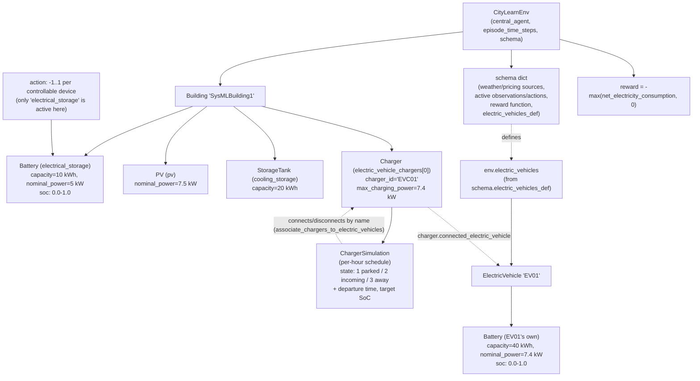

# CityLearn Simulation Doc

Companion reference for `cleanwatts_main_simulation.py`. Explains CityLearn's
own terminology (buildings, devices, actions, EV chargers, rewards) as used
by that file, so "battery storage," "action," and "charger power" don't get
conflated with each other. See `Architectural-Discussion.md` for *why* this
file exists (the CleanWatts/SysML architectural question it's answering);
this doc is purely "what do these CityLearn concepts mean."

## Architecture diagram

How the pieces relate for the one building this demo builds
(`build_device_spec_building`, `cleanwatts_main_simulation.py:124-163`):

Key thing the diagram is meant to make obvious: **the EV charger and the EV
are two different objects with two different owners.** The `Charger` belongs
to the `Building` (like the battery/PV/tank). The `ElectricVehicle` belongs
to the *environment* (`env.electric_vehicles`, sourced from
`schema['electric_vehicles_def']`), not the building — and it carries its
**own separate `Battery`**, distinct from `building.electrical_storage`. The
`ChargerSimulation` schedule is what links them together, hour by hour, by
matching `electric_vehicle_id` strings.

## Glossary

### Building-level devices

Every device below is a `citylearn.energy_model.Device` subclass, owned by
one `Building`, constructed as a plain Python object with physical specs —
the whole point of this demo (see module docstring, point 1).

| Term | What it is | Key attributes |
|---|---|---|
| `Building` | Container for one building's devices, exogenous data (weather/pricing/carbon), and episode bookkeeping. | `electrical_storage`, `pv`, `cooling_storage`, `electric_vehicle_chargers`, ... |
| `Battery` (`electrical_storage`) | The building's stationary battery. | `capacity` (kWh, total energy it can hold), `nominal_power` (kW, max charge/discharge rate), `soc` (state of charge, fraction of capacity currently stored, `0.0`-`1.0`) |
| `PV` (`pv`) | Solar panels. | `nominal_power` (kWp, peak rating). Output each hour comes from a solar-generation timeseries, not from an action. |
| `StorageTank` (`cooling_storage` / `heating_storage` / `dhw_storage`) | Thermal storage — same `capacity`/`soc` idea as the battery, for heat/cold instead of electricity. | `capacity` (kWh-equivalent) |
| `HeatPump` / `ElectricHeater` (`cooling_device` / `heating_device` / `dhw_device`) | The actual heating/cooling equipment. Not used in this demo. | — |

### Actions

| Term | What it is |
|---|---|
| **Action** | A normalized number in `[-1, 1]` sent into `env.step()`, one per *controllable* device slot, per building, per timestep. Converted internally into real energy via that device's `nominal_power` (or `max_charging_power`) and the timestep length — e.g. `action=0.5` on a 5 kW battery for 1 hour ≈ 2.5 kWh charged, before efficiency losses. |
| `env.action_names` | Which device slots are actually controllable, given the current schema/observation-action config. In this demo: `['electrical_storage']` only — the PV, cooling storage, and EV charger have no wired-up action. |
| `battery_action` (our script) | The raw `[-1, 1]` number `battery_policy()` chose (`cleanwatts_main_simulation.py:179-184`) — not the resulting power or SoC. |

### The EV charger sub-layer

This is the part that's easy to conflate, so it's broken into three distinct
things on purpose:

| Term | What it is | Owned by |
|---|---|---|
| `Charger` | The physical charging point. Fixed specs: `max_charging_power` / `min_charging_power` (kW, a capability ceiling — like `nominal_power` for a battery), `efficiency`. | The `Building` (`building.electric_vehicle_chargers`) |
| `ChargerSimulation` | A per-hour *schedule*, not a device: `electric_vehicle_charger_state` (`1` parked & plugged in, `2` incoming, `3` away/commuting), plus arrival/departure time and target SoC. Drives *presence* — a discrete plug-in/unplug event, unrelated to charger power. | The `Charger` (`charger.charger_simulation`) |
| `ElectricVehicle` | The car itself, with its **own `Battery`** (own `capacity`/`nominal_power`/`soc`) — separate from the building's `electrical_storage`. | The **environment**, not the building — defined via `schema['electric_vehicles_def']`, exposed as `env.electric_vehicles` |
| `charger.connected_electric_vehicle` | Set automatically each timestep by CityLearn's `associate_chargers_to_electric_vehicles()`, matching `ChargerSimulation.electric_vehicle_id` against `env.electric_vehicles` by name. `None` when the state is `3` (away). | — |

Since this demo has no action wired to the charger (`action_names` doesn't
include it), the EV connects/disconnects on schedule but never actually
charges — `connected_ev.battery.soc` stays `0.00` the whole run.

### Environment / episode bookkeeping

| Term | What it is |
|---|---|
| `CityLearnEnv` | The whole simulation: holds all buildings (+ the EV pool), runs `reset()`/`step()`, computes reward. |
| `central_agent` | Whether one agent controls all buildings' actions jointly (`True` here) vs. one agent per building. |
| `time_step` | Current hour index into the episode. |
| `episode_time_steps` | Episode length (`EPISODE_HOURS = 24` here — one simulated day). |
| `schema` | The dict describing everything beyond raw device objects: weather/pricing sources, which observations/actions are active, the reward function, and the EV roster (`electric_vehicles_def`). Accepts either a bundled schema name (`str`) or a `dict` you've patched yourself — this demo does the latter to inject `electric_vehicles_def` (`cleanwatts_main_simulation.py:205-208`), since (unlike buildings/devices) EVs can *only* come from the schema, not a constructor kwarg. |

### Reward

| Term | What it is |
|---|---|
| `net_electricity_consumption` | kWh actually drawn from the grid that hour (can be negative if exporting). |
| `reward` (default `RewardFunction`) | `-max(net_electricity_consumption, 0)`, summed across buildings when `central_agent=True`. Penalizes grid draw; never rewards export — capped at `0.0` when the building is self-sufficient or a net exporter that hour. |

## Printout columns (`main()`, `cleanwatts_main_simulation.py:222-243`)

| Column | Meaning |
|---|---|
| `t` | Hour of the episode, `0`-`23`. |
| `temp(C)` / `carbon` | Exogenous inputs we're injecting that hour via `live_weather_and_carbon_intensity()` — written into the building's weather/carbon-intensity arrays right before `env.step()` reads them. Not simulation output. |
| `batt_action` | The `[-1, 1]` value `battery_policy()` sent for `electrical_storage` this hour. |
| `batt_soc` | Resulting battery state of charge, `0.0`-`1.0`, after that action was applied. |
| `ev` | `EV01@<soc>` if the EV is connected to the charger this hour (per the toy schedule), else `away`. SoC stays `0.00` all run since nothing charges it. |
| `reward` | `reward[0]` from the environment — `-max(net_electricity_consumption, 0)` for the one building. |

## Notes on the toy data in this file

- `live_weather_and_carbon_intensity()` and `battery_policy()` are scripted
  stand-ins for what would eventually be live inputs / a SysML action-guard —
  see their docstrings.
- `toy_ev_charger_schedule()` is fabricated: `../../../../cleanwatts-config.json`
  (untracked, confidential, repo root) only has real sensor/actuator IDs for
  its `R-H-01`/`EVC01` entity, not an actual session schedule, so there was
  no real arrival/departure/SoC data to draw the schedule from.
